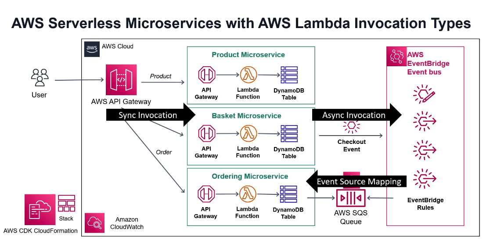

# Welcome to your CDK TypeScript project

# Initial aws console setup
- create account: https://aws.amazon.com
- choose region: us-east-2
- Create an IAM ( give programmatic and console access )
- Make note of: AWS Access Key ID
- Make note of: AWS Secret Access Key
- Login as IAM user

# Installations
- npm install --location=global aws-cli
- npm install --location=global aws-cdk
- npm install --location=global typescript

- npm --version
- aws --version
- tsc --version
- cdk --version
- node --version

# Deploy infrastructure steps
- git pull this project
- cd into project
- run: `aws configure`
- run: `cdk bootstrap`
- run: `cdk synth`
- run: `cdk deploy`

